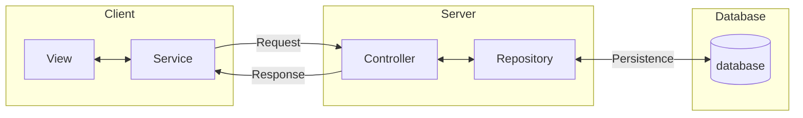

### Documento de Projeto Arquitetural

Neste documento temos o projeto arquitetural do sistema, e uma breve descrição de cada componente.

```mermaid
flowchart LR
    subgraph Client
    View <--> Service
    end
    subgraph Server
    Service -->|Request| Controller
    Controller -->|Response| Service
    Controller <--> Repository
    end
    subgraph Database
    Repository <-->|Persistence| BD[(database)]
    end
```