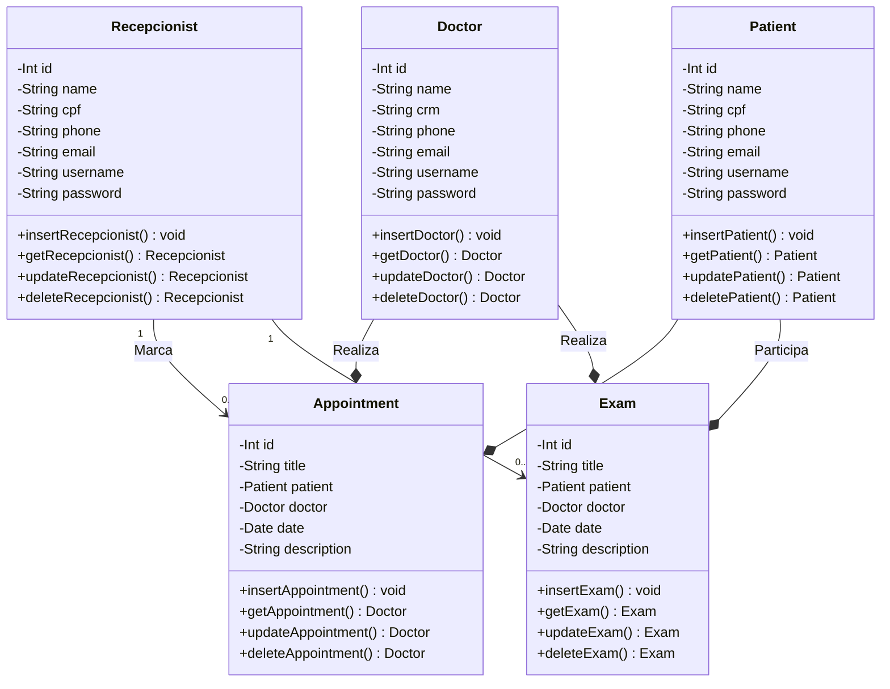

```mermaid
classDiagram
    
    class Recepcionist{
        -Int id
        -String name
        -String cpf
        -String phone
        -String email
        -String username
        -String password

        +insertRecepcionist() void
        +getRecepcionist() Recepcionist
        +updateRecepcionist() Recepcionist
        +deleteRecepcionist() Recepcionist
    }

    class Appointment{
        -Int id
        -String title
        -Patient patient
        -Doctor doctor
        -Date date
        -String description
        
        +insertAppointment() void
        +getAppointment() Doctor
        +updateAppointment() Doctor
        +deleteAppointment() Doctor
    }

    class Exam{
        -Int id
        -String title
        -Patient patient
        -Doctor doctor
        -Date date
        -String description

        +insertExam() void
        +getExam() Exam
        +updateExam() Exam
        +deleteExam() Exam
    }

    class Doctor{
        -Int id
        -String name
        -String crm
        -String phone
        -String email
        -String username
        -String password

        +insertDoctor() void
        +getDoctor() Doctor
        +updateDoctor() Doctor
        +deleteDoctor() Doctor
    }

    class Patient{
        -Int id
        -String name
        -String cpf
        -String phone
        -String email
        -String username
        -String password

        +insertPatient() void
        +getPatient() Patient
        +updatePatient() Patient
        +deletePatient() Patient
    }
    
    Recepcionist "1" -->  "0..*" Appointment: Marca
    Recepcionist "1" -->  "0..*" Exam: Marca
    Doctor  --*  Appointment:Realiza
    Patient  --*  Appointment: Participa
    Patient  --*  Exam: Participa
    Doctor  --*  Exam: Realiza
    
    

```
