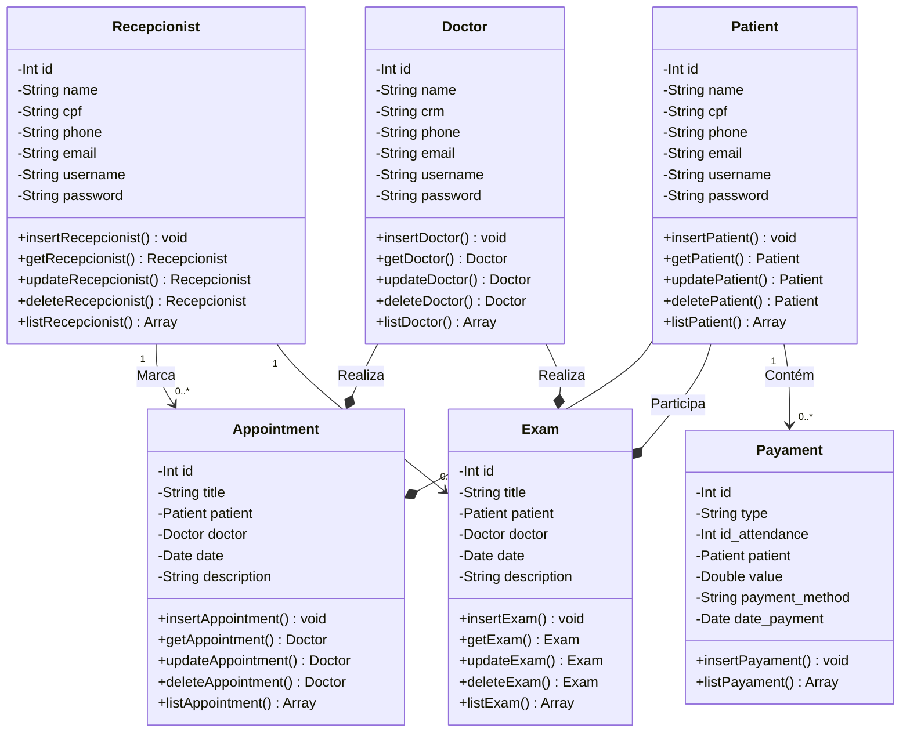
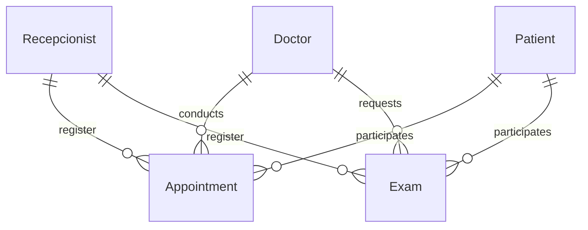

## Documento de Modelos

Neste documento temos o modelo Conceitual (UML) ou de Dados (Entidade-Relacionamento). Temos também a descrição das entidades e o dicionário de dados.

## Modelo Conceitual

## Descrição das Entidades

| Entidade     | Descrição                                              |
|--------------|--------------------------------------------------------|
| Recepcionist | Entidade concreta que representa um(a) recepcionista   |
| Patient      | Entidade que representa o(a) Paciente                  |
| Doctor       | Entidade que representa o(a) Médico(a)                 |
| Appointment  | Entidade que representa a consulta                     |
| Exam         | Entidade que representa o exame                        |

## Modelo de Dados (Entidade-Relacionamento)

## Dicionário de Dados

### Recepcionist
|   Tabela   | Recepcionist  |
| ---------- | ------------- |
| Descrição  | Armazena as informações da recepcionista que realiza o cadastro das consultas|

|  Nome         | Descrição                                                    | Tipo de Dado | Tamanho | Restrições de Domínio |
| ------------- | ------------------------------------------------------------ | ------------ | ------- | --------------------- |
| id            | identificador gerado pelo SGBD                               | INT          | ---     | PK / Identity         |
| name          | representa o nome do(a) recepcionista                        | VARCHAR      | 255     | Not Null              |
| username      | representa o nome de usuário do(a) recepcionista no sistema  | VARCHAR      | 50      | Unique / Not Null     |
| password      | representa a senha de usuário do(a) recepcionista no sistema | VARCHAR      | 50      | Not Null              |

### Patient
|   Tabela   | Patient                                                                         |
| ---------- | --------------------------------------------------------------------------------|
| Descrição  | Armazena as informações do(a) paciente que participa de uma consulta.           |

|  Nome         | Descrição                                                    | Tipo de Dado | Tamanho | Restrições de Domínio |
| ------------- | ------------------------------------------------------------ | ------------ | ------- | --------------------- |
| id            | identificador gerado pelo SGBD                               | INT          | ---     | PK / Identity         |
| name          | representa o nome do(a) paciente                             | VARCHAR      | 255     | Not Null              |
| cpf           | representa o cpf do(a) paciente                              | VARCHAR      | 11      | Unique / Not Null     |
| username      | representa o nome de usuário do(a) paciente no sistema       | VARCHAR      | 50      | Unique / Not Null     |
| password      | representa a senha de usuário do(a) paciente no sistema      | VARCHAR      | 50      | Not Null              |

### Doctor
|   Tabela   | Doctor                                                                          |
| ---------- | --------------------------------------------------------------------------------|
| Descrição  | Armazena as informações do(a) médico(a) que participa de uma consulta.          |

|  Nome         | Descrição                                                    | Tipo de Dado | Tamanho | Restrições de Domínio |
| ------------- | ------------------------------------------------------------ | ------------ | ------- | --------------------- |
| id            | identificador gerado pelo SGBD                               | INT          | ---     | PK / Identity         |
| name          | representa o nome do(a) paciente                             | VARCHAR      | 255     | Not Null              |
| crm           | representa o registro do médico                              | VARCHAR      | 4       | Unique / Not Null     |
| username      | representa o nome de usuário do(a) médico(a) no sistema      | VARCHAR      | 50      | Unique / Not Null     |
| password      | representa a senha de usuário do(a) médico(a) no sistema     | VARCHAR      | 50      | Not Null              |

### Appointment
|   Tabela   | Appoinment                                                                        |
| ---------- | --------------------------------------------------------------------------------- |
| Descrição  | Armazena as informações da consulta médica                                        |

|  Nome         | Descrição                                                    | Tipo de Dado | Tamanho | Restrições de Domínio |
| ------------- | ------------------------------------------------------------ | ------------ | ------- | --------------------- |
| id            | identificador gerado pelo SGBD                               | INT          | ---     | PK / Identity         |
| title         | representa o título da consulta (O ASSUNTO)                  | VARCHAR      | 50      | Not Null              |
| date          | representa a data da consulta                                | DATE         | ---     | Not Null              |
| description   | representa a descrição da consulta, os detalhes              | VARCHAR      | 500     | Not Null              |
| patient       | representa o id do(a) paciente que participou da consulta    | INT          | ---     | FK                    |
| doctor        | representa o id do médico(a) que participou da consulta      | INT          | ---     | FK                    |

### Exam
|   Tabela   | Exam                                                                              |
| ---------- | --------------------------------------------------------------------------------- |
| Descrição  | Armazena as informações do exame que o paciente deve realizar.                    |

|  Nome         | Descrição                                                    | Tipo de Dado | Tamanho | Restrições de Domínio |
| ------------- | ------------------------------------------------------------ | ------------ | ------- | --------------------- |
| id            | identificador gerado pelo SGBD                               | INT          | ---     | PK / Identity         |
| title         | representa o nome do exame                                   | VARCHAR      | 50      | Not Null              |
| description   | representa a descrição do exame, os detalhes                 | VARCHAR      | 500     | Not Null              |
| patient       | representa o cpf do(a) paciente que realizou o exame         | INT          |         | FK                    |
| doctor        | representa o crm do médico(a) que solicitou o exame          | INT          | ---     | FK                    |

